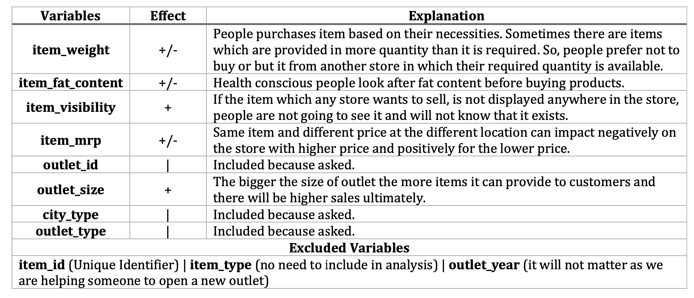
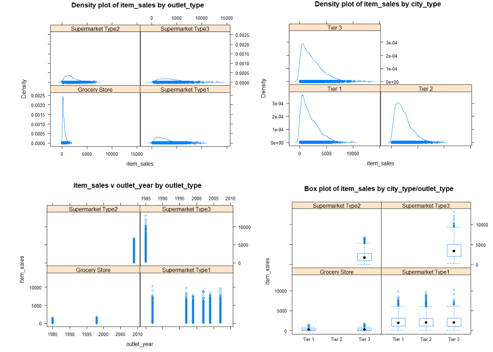

# Statistical Analysis of Big Mart Sales
## Overview and Problem Statement
This dataset contains sales data on different items at multiple outlets of a major retail chain and the data is multi-level.The client is a business entrepreneur considering franchising one or more stores of this retail chain and is looking for the following answers, with adequate justification:

1) What type of outlet will return him the best sales: Grocery store or Supermarket Type 1, 2, or 3.
2) What type of city will return him the best sales: Tier 1, 2 or 3. 
3) What are the top 3 highest performing and lowest performing stores in the sample.

## Data Source and Description
Attributes:

- Item_Weight: Weight of the product
- Item_Fat_Content: Low Fat or Regular
- Item_Visibility: Percentage of total display area of all products in a store allocated to this product
- Item_Type: Dairy, Soft Drinks, Meat, Fruits and Vegetables, Household, Baking Goods, Snack Foods, Frozen Foods, Breakfast, Health and Hygiene, Hard Drinks, Canned, Breads, Starchy Foods, Others, Seafood
- Item_MRP: Maximum Retail Price (list price) of the product
- Outlet_ID: Unique store ID
- Outlet_Year: Year in which store was opened
- Outlet_Size: Store size**: [High, Medium, Small]
- City_Type: Size of city where store is located [Tier 1, Tier 2, Tier 3]
- Outlet_Type: Grocery Store, Supermarket Type1, Supermarket Type2, Supermarket Type3
- Item_Sales: Sales of product in this store

## Variable selection for Multi/Mixed Level Analysis

## Data Visualizations

## 

