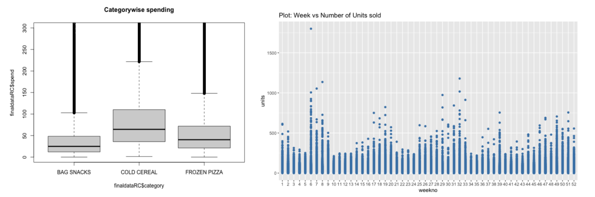

# Statistical Analysis of Big Mart Sales
## Overview and Problem Statement
This dataset contains sales data on different items at multiple outlets of a major retail chain and the data is multi-level.The client is a business entrepreneur considering franchising one or more stores of this retail chain and is looking for the following answers, with adequate justification:

1) What type of outlet will return him the best sales: Grocery store or Supermarket Type 1, 2, or 3.
2) What type of city will return him the best sales: Tier 1, 2 or 3. 
3) What are the top 3 highest performing and lowest performing stores in the sample.

## Action plan for the problem statement
After looking and understanding the data properly,
- There are three different database tables in the spreadsheet. First of all, those database tables should be merged to have a single table to work on.
- As this analysis is only for food products, ‘ORAL HYGIENE PRODUCTS’ and all the transactions associated with those products should be dopped.
- After the above steps, NA values should be removed. NA values could be removed as enough data is available to perform an analysis for significant result.
- There might be some variables which need to be used as a factor and some of them need to be used as a numeric, so those need to be converted into their required datatype.
- By using, some extra features could be created as a discount percentage, week, month of the transaction. These kinds of variables could be use in analysis and could give detailed, significant results for this retain data.

## Data Visualizations

## 

