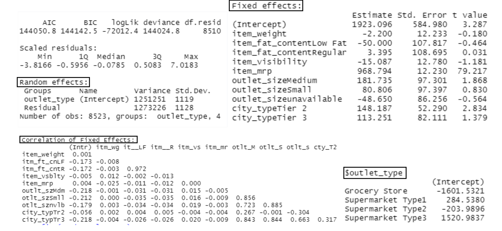
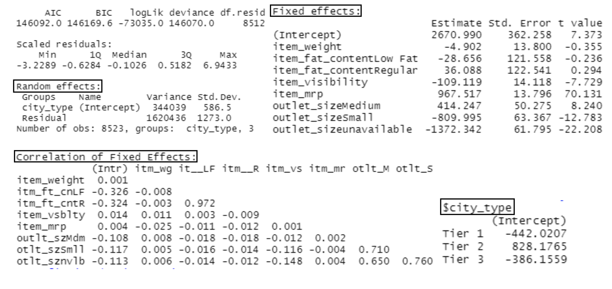
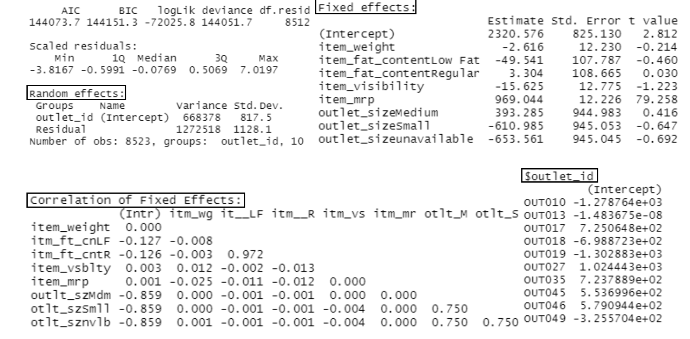

# Statistical Analysis of Big Mart Sales
## Overview and Problem Statement
This dataset contains sales data on different items at multiple outlets of a major retail chain and the data is multi-level.The client is a business entrepreneur considering franchising one or more stores of this retail chain and is looking for the following answers, with adequate justification:

1) What type of outlet will return him the best sales: Grocery store or Supermarket Type 1, 2, or 3.
2) What type of city will return him the best sales: Tier 1, 2 or 3. 
3) What are the top 3 highest performing and lowest performing stores in the sample.

## Data Source and Description
Attributes of the dataset:

- **Item_Weight:** Weight of the product
- **Item_Fat_Content:** Low Fat or Regular
- **Item_Visibility:** Percentage of total display area of all products in a store allocated to this product
- **Item_Type:** Dairy, Soft Drinks, Meat, Fruits and Vegetables, Household, Baking Goods, Snack Foods, Frozen Foods, Breakfast, Health and Hygiene, Hard Drinks, Canned, Breads, Starchy Foods, Others, Seafood
- **Item_MRP:** Maximum Retail Price (list price) of the product
- **Outlet_ID:** Unique store ID
- **Outlet_Year:** Year in which store was opened
- **Outlet_Size:** Store size**: [High, Medium, Small]
- **City_Type:** Size of city where store is located [Tier 1, Tier 2, Tier 3]
- **Outlet_Type:** Grocery Store, Supermarket Type1, Supermarket Type2, Supermarket Type3
- **Item_Sales:** Sales of product in this store

## Variable selection for Multi/Mixed Level Analysis

## Data Visualizations

## Model Buidling and Results
#### 1) What type of outlet will return him the best sales: Grocery store or Supermarket Type 1, 2, or 3.

**Interpreatation:** After looking at the outputs here and analyzing the results, I would suggest my client to consider franchising with the outlet type of “Suptermarket 3”. Because as I add those random effects values of each type of outlet in average block, I am getting maximum sales at Supermarket 3. It will get the maximum sales based in this analysis.

#### 2) What type of city will return him the best sales: Tier 1, 2 or 3. 

**Interpreatation:** After looking at the outputs here and analysing the results, I would say that city from “Tier 2” could get the maximum sales. As I those random effects values of each type of city in average block, city from “Tier 2” can get the maximum sales to business owner.

#### 3) What are the top 3 highest performing and lowest performing stores in the sample.

**Interpreatation:** After looking the outputs here and analyzing the results I would say rank outlet as below:
TOP 3: 1) OUT027, 2) OUT017, 3) OUT035
BOTTOM 3: 10) OUT019, 9) OUT010, 8) OUT018

